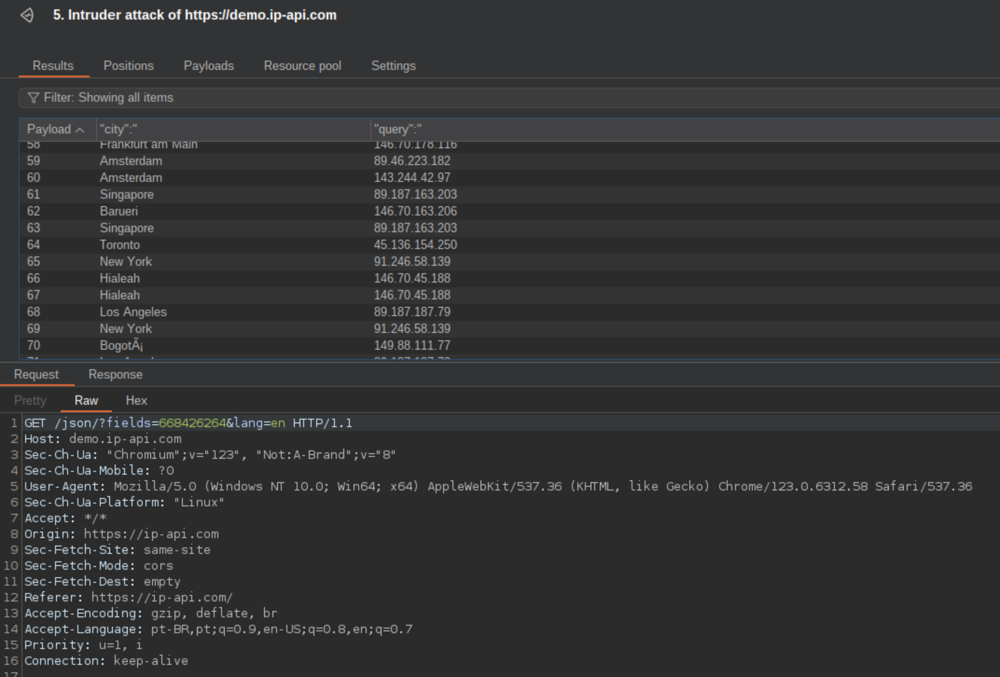

# Shark-Proxy-Rotate 

<div align="center">
    
</div>

## Description

Shark-Proxy-Rotate, previously Ovpn-To-Proxy-Adapter, enhances the brilliant foundational work of the original by DoganM95. This project extends its functionality to support a rotating proxy mechanism, crucial for scenarios requiring each outbound request to navigate through a distinct proxy. This adaptation allows for dynamic selection of any VPN configuration from the `config-files` directory, leveraging Surfshark credentials, to establish a VPN connection. The flexibility to choose any .ovpn file facilitates seamless connectivity across a wide array of global locations, ensuring users can bypass IP bans effectively, with minimal setup.

The inclusion of Mubeng for proxy rotation underscores the project's simplicity and efficiency, eliminating the need for extensive configuration. Mubeng's two core functionalities:
1. Proxy server operation with IP rotation, circumventing IP bans like brute-force defenses, API rate-limits, and WAF IP blockades.

## Prerequisites

- Docker
- dos2unix (to convert VPN list files to Unix format)
- Docker Compose is optional but recommended for easier management of Docker applications.

## Environment Setup

Configure the `.env` file within the project directory. Here's a detailed explanation of each variable:

- `VPN_LOCATION`: Set to "list" to specify the use of a predefined list of VPN locations from the `ovpn_list`.
- `VPN_PROVIDER`: Identifies the VPN service provider, set to "SURFSHARK" for this project.
- `STARTING_PORT`: Designates the starting port for the proxy service; begins at 8900 for sequential port assignment.
- `VPN_USERNAME`: Your VPN account username, e.g., "user".
- `VPN_PASSWORD`: The corresponding VPN account password, e.g., "pass".
- `CONTAINER_RESTART`: Docker container restart policy, set to "unless-stopped" to ensure containers restart unless manually stopped.
- `NETWORK_CIDR`: The CIDR block of your host network, set to "172.16.1.0/24" for this project.
- `CONFIG_PATH`: The full path to the VPN configuration files.
- `MUBENG_PORT`: The port number on which Mubeng operates.
- `PROXIES_PATH`: The full path where proxy lists are saved.
- `MUBENG_METHOD`: The method Mubeng uses for proxy rotation, set to "sequent" for sequential rotation.
- `MUBENG_ROTATE`: Controls how frequently Mubeng rotates proxies, with "1" indicating rotation after every request.

These configurations ensure your Shark-Rotate setup is tailored to utilize Surfshark VPNs, with each component working together to provide a robust rotating proxy service.

### Batch Proxy Creation

For batch proxy creation, where you want to create multiple proxies for different locations as listed in your `ovpn_list`, ensure the `VPN_LOCATION` variable in your `.env` file is set to `list`, and your `ovpn_list` file is populated with your desired VPN locations, such as:

```plaintext
jp-tok-st014.prod.surfshark.com_udp.ovpn
ua-iev.prod.surfshark.com_udp.ovpn
us-nyc.prod.surfshark.com_tcp.ovpn
```

## Execution

To initiate Shark-Rotate, execute the `spawn.sh` script with superuser permissions:

```bash
sudo ./spawn.sh
```

This script dynamically generates Docker containers for each specified VPN connection, maps them to HTTP proxies, and leverages Mubeng to facilitate proxy rotation.

## Usage Example

To illustrate the rotating proxy feature, run the following loop, making requests through Mubeng, ensuring each traverses a different proxy:

```bash
while true; do
    curl -x http://PROXY-IP:MUBENG_PORT http://ip-api.com/;
done
```

Output examples demonstrating the proxy rotation, with each request emanating from a unique IP address:

```json
{
  "status": "success",
  "country": "Canada",
  "city": "Toronto",
  "query": "45.136.154.250"
}
{
  "status": "success",
  "country": "United States",
  "city": "Denver",
  "query": "169.150.231.195"
}
{
  "status": "success",
  "country": "United States",
  "city": "Chicago",
  "query": "138.199.42.185"
}
{
  "status": "success",
  "country": "Sri Lanka",
  "city": "Sri Lanka",
  "query": "62.197.156.37"
}
{
  "status": "success",
  "country": "Slovenia",
  "city": "Ljubljana",
  "query": "195.158.249.26"
}
{
  "status": "success",
  "country": "Uruguay",
  "city": "Montevideo",
  "query": "212.119.32.35"
}


```




Each response reflects a different geographic location, validating the operational efficacy of Shark-Rotate’s proxy rotation.

Shark-Proxy-Rotate offers an efficient, streamlined solution for managing and rotating proxies, harnessing Surfshark VPN configurations, and enhancing user anonymity and access capabilities across the digital landscape.
